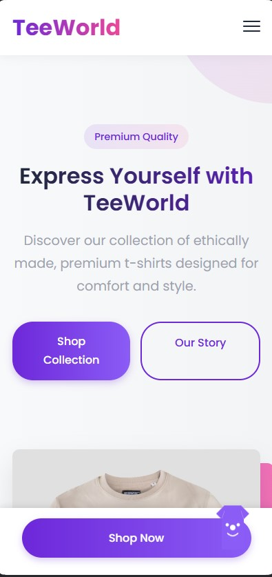
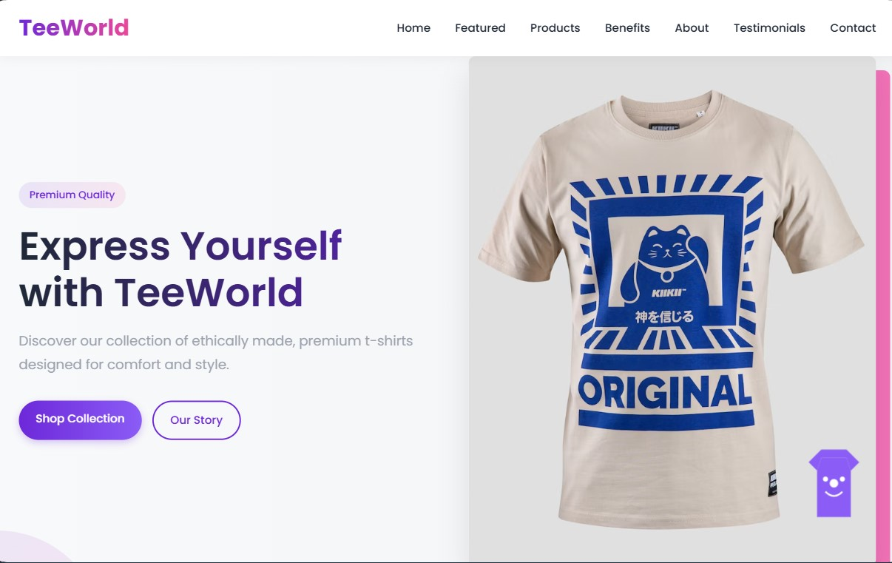
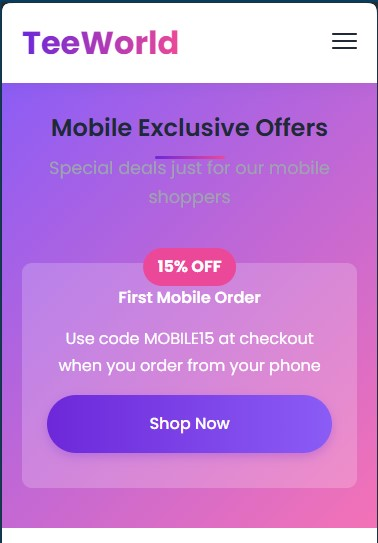
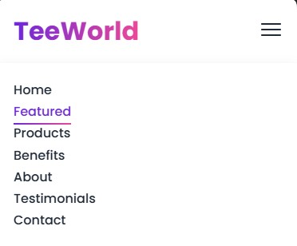
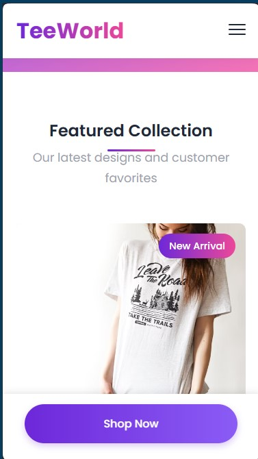
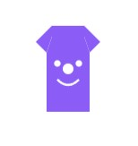

# Lab 3 - Responsive Design & Animations

This project builds upon the TeeWorld landing page from Lab 2, enhancing it with responsive design features and interactive animated elements.

## Live Demo

🔗 [View Live Demo](https://qopas.github.io/tum-web-lab2/)

## Project Overview

For Lab 3, TeeWorld's landing page has been improved with mobile responsiveness and an animated mascot to enhance user experience across all devices. The project meets all customer and developer requirements while maintaining the clean, modern aesthetic established in Lab 2.



## Improvements from Lab 2

### Responsive Design

- **Mobile-Optimized Layout**: Restructured content to display properly on mobile devices
- **Flexible Sizing**: Ensured all elements adjust appropriately for different screen sizes
- **Mobile Navigation**: Implemented a hamburger menu toggle for smaller screens
- **Persistent Call-to-Action**: Added a fixed CTA button that remains visible when scrolling on mobile
- **Touch-Friendly Elements**: Increased button sizes and spacing for better touch interaction

### Mobile-Only Elements

- **Exclusive Mobile Offer Section**: Added a special promotional section that only displays on mobile devices
- **Mobile Discount Badge**: Created a prominent discount offer visible only to mobile users
- **Mobile-Specific Navigation Menu**: Designed a slide-in navigation that's optimized for mobile interaction

### Interactive Mascot

- **Friendly T-shirt Character**: Designed a custom SVG mascot related to the business theme
- **Delayed Appearance**: The mascot appears 3 seconds after page load
- **Animation**: Implemented a bouncing animation that makes the mascot feel lively
- **Interactive Message**: Added a tooltip that appears when hovering over the mascot
- **Strategic Placement**: Positioned the mascot in the corner of the screen to avoid interfering with content

## Screenshots

### Responsive Design




### Mobile-Only Elements





### Mascot




## Implementation Details

### Responsive Design Approach

The responsive design was implemented using:
- CSS media queries to target different screen sizes
- Flexbox and CSS Grid for flexible layouts
- Relative units (%, em, rem) instead of fixed pixel sizes
- Mobile-first approach for CSS organization

### Key Breakpoints

- Mobile: Up to 576px
- Tablet: 577px to 991px
- Desktop: 992px and above

### Mascot Implementation

The mascot was created using:
- Custom SVG code for lightweight, scalable graphics
- CSS animations for the bouncing effect
- CSS transitions for smooth hover interactions

## Code Snippets

### Responsive Media Query Example

```css
@media (max-width: 576px) {
  .hero-content h2 {
    font-size: 2rem;
  }
  
  .product-grid {
    grid-template-columns: 1fr;
  }
  
  .mobile-only {
    display: block;
  }
}
```

### Mascot Animation

```css
.mascot {
  animation: bounce 2s infinite;
}

@keyframes bounce {
  0%, 100% { transform: translateY(0); }
  50% { transform: translateY(-15px); }
}
```

## Technologies Used

- HTML5
- CSS3 (Vanilla - no frameworks)
## Development Process

1. **Analysis of Lab 2 Website**
   - Identified responsive design issues
   - Planned mobile-optimized layout changes

2. **Responsive Implementation**
   - Added media queries for breakpoints
   - Restructured layout for mobile devices
   - Created mobile-only elements

3. **Mascot Design & Implementation**
   - Designed SVG mascot to match brand style
   - Implemented animations and interactions
   - Added delayed appearance logic

4. **Testing & Refinement**
   - Tested across multiple device sizes
   - Refined animations for performance
   - Ensured all customer requirements were met

## How to Run Locally

1. Clone the repository
   ```
   git clone https://github.com/qopas/tum-web-lab3.git
   ```

2. Open the project folder and launch index.html in your browser
