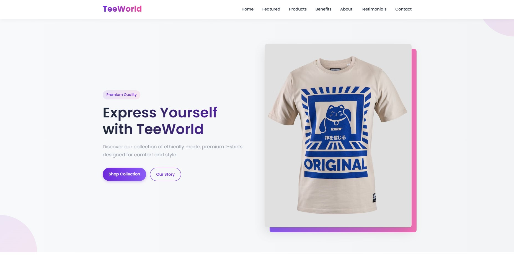
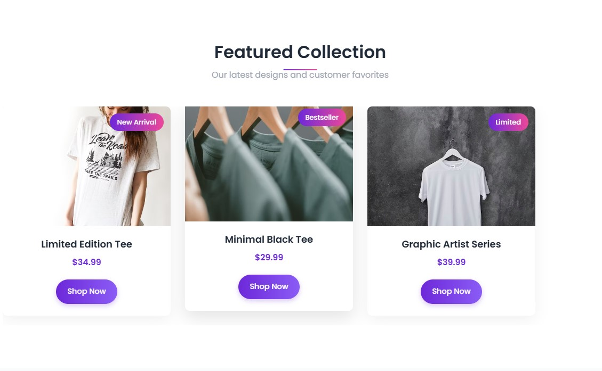
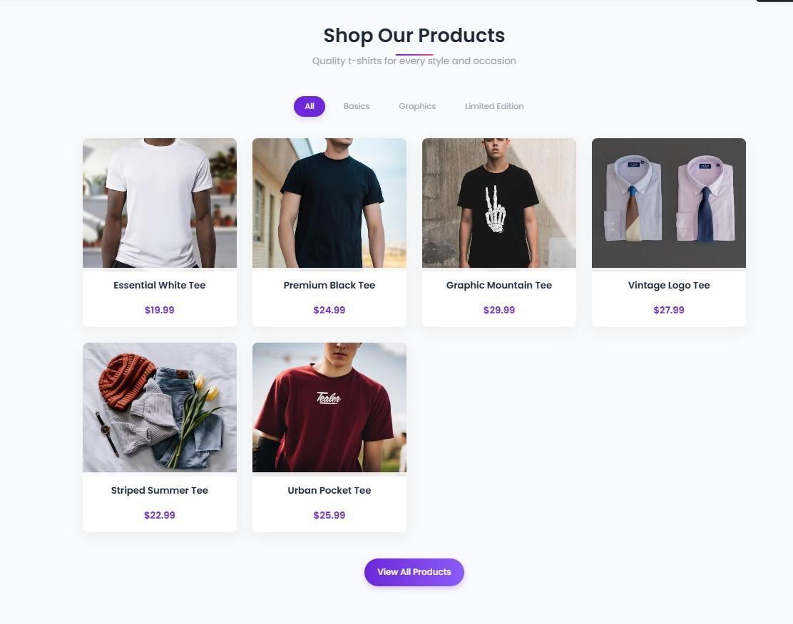
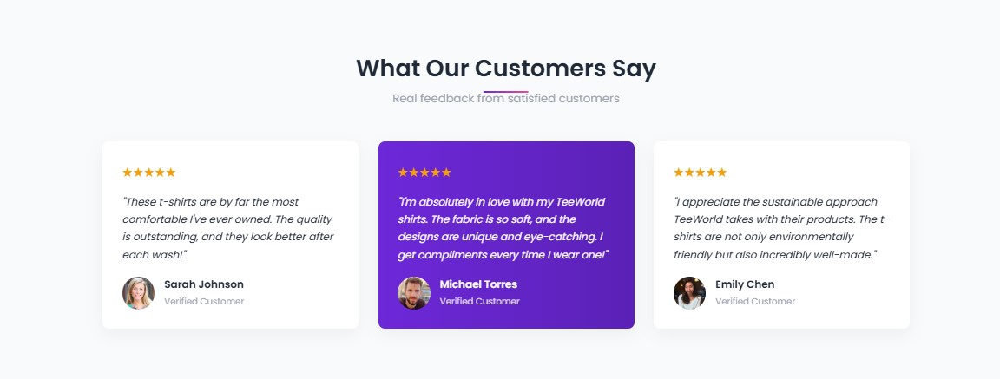

# Lab 2 - Landing page

Create a web page for your/friends/relatives business (example: car-rent, cookies-shop, crypto-scam)

## Customer requirements

- Some form of navigation to sections (links, buttons)
- Call to action
- At least 4 sections ([see examples](https://webflow.com/blog/high-converting-landing-page))
- Pleasant to the eyes

## Dev requirements

- Use vanilla CSS and HTML (no frameworks)
- Have a decent git history (no one commit)
- The page should be deployed on a free hosting service (example: GitHub Pages, Vercel, Netlify)
- Project repo should have a README with a short description of the landing page topic, screenshots, and a link to the live demo

## Other requirements:

- For potential maximal mark, a WIP version should be submitted during the class
- Use index.html, reset.css

# TeeWorld - Modern T-shirt Business Landing Page



A modern, responsive landing page for a t-shirt business with multiple sections, product displays, and interactive elements.

## Live Demo

🔗 [View Live Demo](https://qopas.github.io/tum-web-lab2/)

## Project Overview

TeeWorld is a sleek, modern landing page for a t-shirt business that showcases products in an engaging way. The site features a clean design with gradients, subtle animations, and a fully responsive layout that works across all devices.

### Screenshots






## Features

- **Modern UI Design** - Clean, contemporary aesthetic with gradient accents
- **Fully Responsive** - Optimized for mobile, tablet, and desktop devices
- **Multiple Sections** - Hero, Featured Collection, Products, Benefits, About, Testimonials, Newsletter, and Contact
- **Interactive Elements** - Hover effects, smooth scrolling, and product action buttons
- **Product Showcase** - Dedicated product grid with filtering options
- **Testimonials** - Customer feedback section with featured review highlight
- **Contact Form** - Styled form with validation
- **Newsletter Signup** - Email subscription section
- **Mobile-Friendly Navigation** - Collapsible menu for smaller screens

## Technologies Used

- HTML5
- CSS3 (Vanilla CSS, no frameworks)
- Modern CSS features:
  - CSS Variables
  - Flexbox
  - CSS Grid
  - Gradients
  - Transitions & Animations
- Google Fonts
- Reset CSS

## Project Structure

```
/
├── index.html          # Main HTML structure
├── reset.css           # CSS reset
├── style.css           # Custom styles
├── screenshots/        # Project screenshots
│   ├── hero-section.png
│   ├── featured-section.png
│   ├── products-section.png
│   └── testimonials-section.png
└── README.md           # Project documentation
```

## Development Process

The project was developed using a structured approach:

1. **Planning & Design Phase**
   - Defined sections and layout
   - Selected color scheme and typography

2. **HTML Structure**
   - Created semantic HTML markup
   - Organized sections and content structure

3. **CSS Styling**
   - Implemented base styles and CSS variables
   - Styled individual sections
   - Added hover effects and transitions
   - Built responsive layouts

4. **Responsive Design**
   - Implemented mobile-first approach
   - Added media queries for different screen sizes

## Deployment

The website is deployed using GitHub Pages:

1. Project repository was created on GitHub
2. Main branch was configured as the source for GitHub Pages
3. Site is automatically updated when changes are pushed to the main branch

## Credits

- Images sourced from [Unsplash](https://unsplash.com/)
- Icons from [Feather Icons](https://feathericons.com/)
- Fonts from [Google Fonts](https://fonts.google.com/)

## License

This project is available under the MIT License - see the LICENSE file for details.